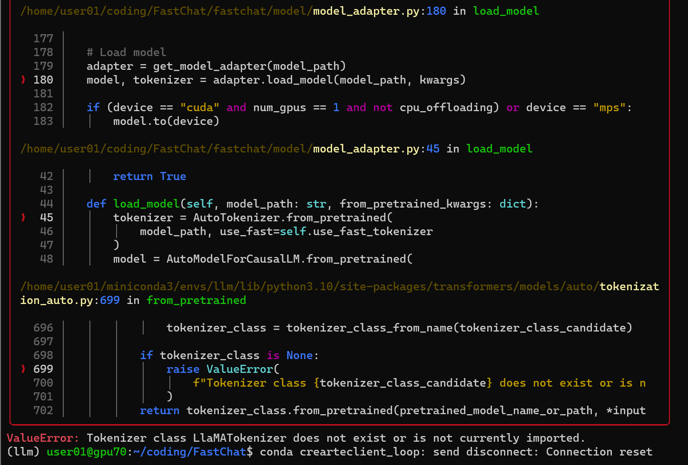
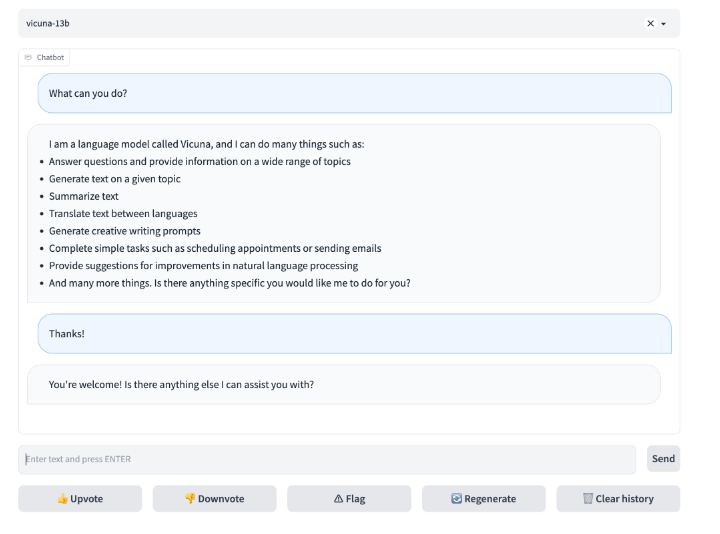

# 【LLMs 入门实战 —— 七 】Vicuna 模型学习与实战

- github 地址: https://github.com/lm-sys/FastChat

## 一、前言

UC伯克利学者联手CMU、斯坦福等，再次推出一个全新模型70亿/130亿参数的Vicuna，俗称「小羊驼」（骆马）。小羊驼号称能达到GPT-4的90%性能

## 二、环境搭建

### 2.1 构建环境

```s
    $ conda create -n py310_chat python=3.10       # 创建新环境
    $ source activate py310_chat                   # 激活环境
```

### 2.2 安装 FastChat

#### 2.2.1 利用 pip 安装

```s
    $ pip install fschat
```

#### 2.2.2 从 github 下载 repository  安装

1. clone repository，然后 加入 FastChat folder 

```s
    $ git clone https://github.com/lm-sys/FastChat.git
    $ cd FastChat
```

2. 安装 包

```s
    $ pip install --upgrade pip  # enable PEP 660 support
    $ pip install -e .
```

## 三、Vicuna Weights 生成

### 3.1 官方提供 的 Vicuna Weights 生成方式

我们将 Vicuna Weights 作为 delta weights 发布，以符合LLaMA模型许可证。您可以将我们的delta添加到 原始 LLaMA Weights 中，以获得 Vicuna Weights 。说明：

1. 按照 [此处](https://huggingface.co/docs/transformers/main/model_doc/llama) 的说明，以 huggingface format 获取原始 LLaMA Weights;
2. 使用以下脚本通过应用我们的delta来获得 Vicuna weights 。他们会自动从我们的  Hugging Face account 下载 Vicuna Weights 。

> 注：权重v1.1 仅与 transformers>=4.28.0 和 fschat>=0.2.0 兼容。请相应地更新您的 本地package 。如果您按照上面的命令进行新的安装，那么您应该得到所有正确的版本。

### 3.2 本项目所使用的的 Vicuna Weights 生成方式

> 参考：[How to Prepare Vicuna Weight](https://github.com/Vision-CAIR/MiniGPT-4/blob/main/PrepareVicuna.md)

#### 3.2.1 下载 Vicuna Weight

当前版本的MiniGPT-4是建立在v0版本的 Vicuna-13B 之上的。请参考我们的说明来准备 Vicuna weights。最终的权重将在结构类似于以下的单个文件夹中:

> 注：Vicuna是一个开源的基于llama的LLM，其性能接近ChatGPT。我们目前使用的是v0版本的Vicuna-13B。

```s
    $ git lfs install
    $ git clone https://huggingface.co/lmsys/vicuna-13b-delta-v1.1  # more powerful, need at least 24G gpu memory
    $ # or
    $ git clone https://huggingface.co/lmsys/vicuna-7b-delta-v1.1  # smaller, need 12G gpu memory
```

> 请注意，这不是直接的 working weight ，而是LLAMA-13B的 working weight 与 original weight 的差值。(由于LLAMA的规则，我们无法分配LLAMA的 weight 。)

#### 3.2.2 下载 原始LLAMA-7B或LLAMA-13B权重

然后，您需要按照HuggingFace提供的[原始权重](https://huggingface.co/docs/transformers/main/model_doc/llama) 或 从互联网上获取 [HuggingFace格式的原始LLAMA-7B或LLAMA-13B 权重](https://huggingface.co/decapoda-research/llama-7b-hf)。

> 注：这里 直接 从 HuggingFace 下载 已转化为 HuggingFace格式的原始LLAMA-7B或LLAMA-13B 权重

```s
    $ git lfs install
    $ git clone https://huggingface.co/decapoda-research/llama-13b-hf  # more powerful, need at least 24G gpu memory
    $ # or
    $ git clone https://huggingface.co/decapoda-research/llama-7b-hf  # smaller, need 12G gpu memory
```

#### 3.2.3 构建真正的 working weight  

当这两个 weight 备好后，我们可以使用Vicuna团队的工具来创建真正的 working weight  。

执行如下命令创建最终 working weight

```s
    $ python -m fastchat.model.apply_delta --base /path/to/llama-13bOR7b-hf/  --target /path/to/save/working/vicuna/weight/  --delta /path/to/vicuna-13bOR7b-delta-v1.1/ --low-cpu-mem
    >>>
    The tokenizer class you load from this checkpoint is not the same type as the class this function is called from. It may result in unexpected tokenization. 
    The tokenizer class you load from this checkpoint is 'LLaMATokenizer'. 
    The class this function is called from is 'LlamaTokenizer'.
    Split files for the base model to /tmp/tmptu2g17_d
    100%|██████████████████████████████████████████████████████████████████████████████████████████████████████| 33/33 [01:47<00:00,  3.26s/it]
    Split files for the delta model to /tmp/tmpol8jc2oy
    100%|████████████████████████████████████████████████████████████████████████████████████████████████████████| 2/2 [01:03<00:00, 31.92s/it]
    Applying the delta
    33it [02:09,  3.91s/it]
    Saving the target model to vicuna/weight/

```

> 注：低CPU内存需加入--low-cpu-mem，可以把大的权重文件分割成多个小份，并使用磁盘作为临时存储。可以使峰值内存保持在16GB以下。不然无法载入vicuna增量文件，CPU内存占满，程序直接被kill，

>  output
```s
config.json           pytorch_model-16.bin  pytorch_model-23.bin  pytorch_model-30.bin  pytorch_model-8.bin
pytorch_model-0.bin   pytorch_model-17.bin  pytorch_model-24.bin  pytorch_model-31.bin  pytorch_model-9.bin
pytorch_model-10.bin  pytorch_model-18.bin  pytorch_model-25.bin  pytorch_model-32.bin  pytorch_model.bin.index.json
pytorch_model-11.bin  pytorch_model-19.bin  pytorch_model-26.bin  pytorch_model-3.bin   special_tokens_map.json
pytorch_model-12.bin  pytorch_model-1.bin   pytorch_model-27.bin  pytorch_model-4.bin   tokenizer_config.json
pytorch_model-13.bin  pytorch_model-20.bin  pytorch_model-28.bin  pytorch_model-5.bin   tokenizer.model
pytorch_model-14.bin  pytorch_model-21.bin  pytorch_model-29.bin  pytorch_model-6.bin
pytorch_model-15.bin  pytorch_model-22.bin  pytorch_model-2.bin   pytorch_model-7.bin

```

### 3.0 填坑手册

#### 3.0.1 ValueError: Tokenizer class LLaMATokenizer does not exist or is not currently imported.

> 参考：
> 1. [MiniGPT-4 本地部署 RTX 3090](https://zhuanlan.zhihu.com/p/624417097)
> 2. [LLaMATokenizer does not exist or is not currently imported- LLaMA 4-bit ](https://github.com/oobabooga/text-generation-webui/issues/233)

1. 打开fastchat.model.apply_delta.py
2. 使用文本替换，将所有的
   1. AutoTokenizer 替换为 LlamaTokenizer
   2. AutoModelForCausalLM 替换为 LlamaForCausalLM
   3. 保存
3. 重新运行上面的命令即可。

#### 3.0.2 如果你的CPU内存不足，您也可以尝试通过这些方法来减少权重转换对 CPU 内存的要求

- 方案一：将 --low-cpu-mem 追加到上面的命令中，这会将大权重文件拆分为较小的文件，并将磁盘用作临时存储。 这可以将峰值内存保持在 16GB 以下；

```s
    $ python -m fastchat.model.apply_delta --base /mnt/kaimo/data/chat/llama-7b-hf/  --target /mnt/kaimo/data/chat/vicuna/weight/  --delta /mnt/kaimo/data/chat/vicuna-7b-delta-v0/ --low-cpu-mem
```

- 方案二：创建一个大的交换文件并依靠操作系统自动的将磁盘当作虚拟内存。

#### 3.0.3 tensor尺度不一致

bug：tensor尺度不一致

RuntimeError: The size of tensor a (32000) must match the size of tensor b (32001) at non-singleton dimension 0

当使用v0版本时，生成vicuna权重出错（bug：tensor尺度不一致），而换为v1.1版本即可解决。

## 四、使用命令行接口进行推理

### 4.1 介绍

> 注：（实验功能：您可以指定--style rich，以便为某些非ASCII内容提供富格文本输出和更好的文本流质量。这在某些终端上可能无法正常工作。）

```python
init_kwargs {'torch_dtype': torch.float16}
Loading checkpoint shards: 100%| | 33/33 [00:41<00:00,  1.24s/it]
USER: Implement a Python function to compute fibonacci numbers
ASSISTANT: Here is an implementation of a function `fibonacci` that computes the nth Fibonacci number:

def fibonacci(n):
    """
    Compute the nth Fibonacci number using the recurrence relation
    F(n) = F(n-1) + F(n-2)
    """
    if n < 0 or n > 1:
        raise ValueError("n must be a positive integer")
    if n == 0:
        return 0
    if n == 1:
        return 1
    result = fibonacci(n-1) + fibonacci(n-2)
    return result

```

### 4.2 Single GPU

下面的命令要求Vicuna-13B大约有28GB的GPU内存，Vicuna-7B大约有14GB的GPU存储器。如果内存不足，请参阅下面的“内存不足”部分。

```shell
    $ python -m fastchat.serve.cli --model-path /path/to/vicuna/weights 
```

- 参数介绍

```s
usage: cli.py [-h] 
    [--model-path MODEL_PATH]                     Vicuna Weights 路径
    [--device {cpu,cuda,mps}]                     选择 使用 cpu or cuda 运行
    [--gpus GPUS]                                 选择 使用 gpu 型号
    [--num-gpus NUM_GPUS]                         选择 gpu 数量
    [--max-gpu-memory MAX_GPU_MEMORY] 
    [--load-8bit]                                 8bit 量化，用于降低显存
    [--conv-template CONV_TEMPLATE]
    [--temperature TEMPERATURE] 
    [--max-new-tokens MAX_NEW_TOKENS] 
    [--style {simple,rich}] 
    [--debug]
```

### 4.3 Multiple GPUs

You can use model parallelism to aggregate GPU memory from multiple GPUs on the same machine.

```shell
    python -m fastchat.serve.cli --model-path /path/to/vicuna/weights --num-gpus 2
```

### 4.4 CPU Only

这只在CPU上运行，不需要GPU。Vicuna-13B需要大约60GB的CPU内存，Vicuna-7B需要大约30GB的CPU存储器。

```shell
    $ python -m fastchat.serve.cli --model-path /path/to/vicuna/weights --device cpu
```

### 4.0 填坑手册

#### 4.0.1 No Enough Memory or Other Platforms

如果内存不足，可以通过在上面的命令中添加 --load-8bit 来启用 8位压缩。这可以将内存使用量减少约一半，同时略微降低模型质量。它与CPU、GPU和Metal后端兼容。具有8位压缩的Vicuna-13B可以在单个NVIDIA 3090/4080/V100（16GB）GPU上运行。

```s
    $ python -m fastchat.serve.cli --model-path /path/to/vicuna/weights --load-8bit
```

#### 4.0.2 Tokenizer class LlaMATokenizer does not exist or is not currentlv imported

- 问题描述：运行 以下命令

```shell
    $ python -m fastchat.serve.cli --model-path /path/to/vicuna/weights 
```

出现以下问题：



- 解决方法：

将 FastChat/fastchat/model/model_adapter.py 里面 的 

```s
    tokenizer = AutoTokenizer.from_pretrained(model_path， use_fast=self.use_fast_tokenizer
    model = AutoModelForCausalLM.from_pretrained(...)
```

使用文本替换，将所有的

1. AutoTokenizer 替换为 LlamaTokenizer
2. AutoModelForCausalLM 替换为 LlamaForCausalLM
3. 保存

重新运行即可

## 五、使用Web GUI服务

### 5.1 介绍



要使用web UI提供服务，您需要三个主要组件：与用户接口的web服务器、托管一个或多个模型的模型工作者，以及协调web服务器和模型工作者的控制器。以下是您的终端中要遵循的命令：

1. Launch the controller

```s
    $ python -m fastchat.serve.controller
```

此控制器管理分布式工作程序。

2. Launch the model worker

```s
    $ python -m fastchat.serve.model_worker --model-path /path/to/vicuna/weights
```

等待流程完成加载模型，然后看到“Uvicorn running on ...”。

您可以启动多个模型工作程序来同时为多个模型提供服务。模型工人将自动连接到控制器。

要确保模型工作者正确连接到控制器，请使用以下命令发送测试消息：

```s
    $ python3 -m fastchat.serve.test_message --model-name vicuna-13b
```

3. Launch the Gradio web server

```s
    $ python -m fastchat.serve.gradio_web_server
```

这是用户将与之交互的用户界面。

通过以下步骤，您将能够使用web UI为您的模型提供服务。您现在可以打开浏览器并与模特聊天了。


## 参考

1. [FastChat](https://github.com/lm-sys/FastChat)
2. [Vicuna: An Open-Source Chatbot Impressing GPT-4 with 90%* ChatGPT Quality](https://vicuna.lmsys.org/)
3. [Vicuna-13B模型可在线试玩，参数已开源可下载](https://zhuanlan.zhihu.com/p/619257262)
4. [GPT-4 “认为” 我们的开源版对话模型达到了ChatGPT 90%的性能 —— Vicuna 开发深度经验分享](https://zhuanlan.zhihu.com/p/618389519)
5. [facebookresearch/llama](https://github.com/facebookresearch/llama)
6. [stanford_alpaca](https://github.com/tatsu-lab/stanford_alpaca)
7. [alpaca-lora](https://github.com/tloen/alpaca-lora)
8. [Alpaca: A Strong, Replicable Instruction-Following Model](https://crfm.stanford.edu/2023/03/13/alpaca.html)
9.  [llama-7b-hf/tree/main](https://huggingface.co/decapoda-research/llama-7b-hf/tree/main)
10. [LLM系列 | 02: Vicuna简介及模型部署实测](https://mp.weixin.qq.com/s/aYISevR_qJTNPZKK_VkmZw)
