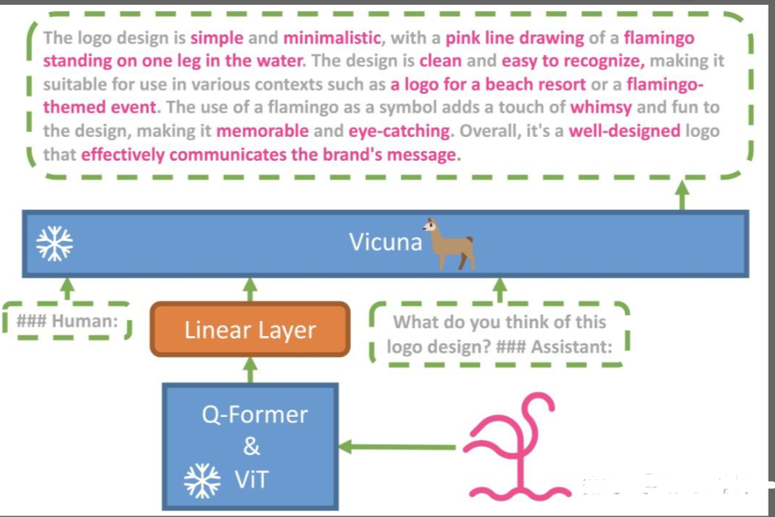
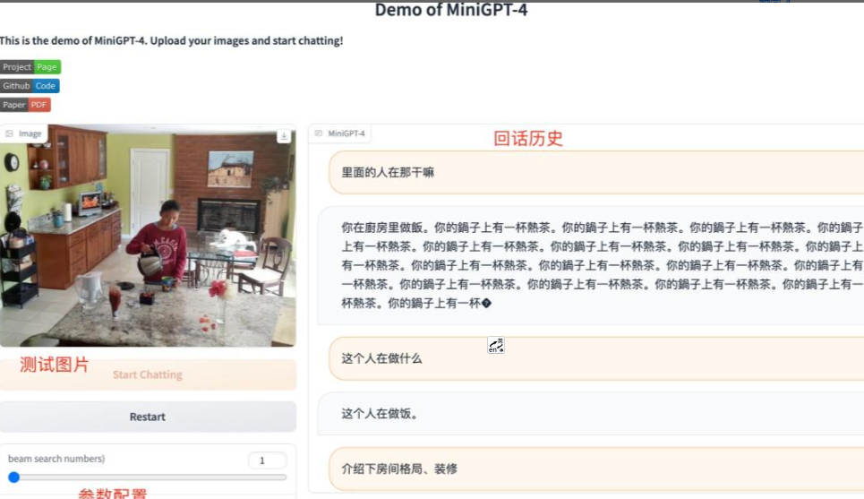

# 【LLMs 入门实战 —— 八 】MiniGPT-4 模型学习与实战

> 参考：[MiniGPT-4](https://github.com/Vision-CAIR/MiniGPT-4)

## 一、前言

还在苦苦等待GPT-4开放？开源项目MiniGPT-4就能提前体验类似GPT-4的多模态对话功能。

2023年4月17日，多模态问答模型MiniGPT-4发布，实现了GPT-4里的宣传效果

《MiniGPT-4: Enhancing Vision-language Understanding with Advanced Large Language Models》

阿卜杜拉国王科技大学的几位博士（看名字都是中国人）开发，他们认为GPT-4 先进的多模态生成能力，主要原因在于利用了更先进的大型语言模型。

为了验证这一想法，团队成员将一个冻结的视觉编码器(Q-Former&ViT)与一个冻结的 文本生成大模型（Vicuna，江湖人称：小羊驼） 进行对齐，造出了 MiniGPT-4。

- MiniGPT-4 具有许多类似于 GPT-4 的能力, 图像描述生成、从手写草稿创建网站等
- MiniGPT-4 还能根据图像创作故事和诗歌，为图像中显示的问题提供解决方案，教用户如何根据食物照片做饭等。

## 二、模型介绍

### 2.1 模型结构介绍

- 投影层（Projection Layer）是神经网络中常见层类型，将输入数据从一个空间映射到另一个空间。
- NLP中，投影层通常用于将高维词向量映射到低维空间，以减少模型参数数量和计算量。
- CV中，投影层可以将高维图像特征向量映射到低维空间，以便于后续处理和分析。



### 2.2 fine tune 介绍

1. 先是在 4 个 A100 上用 500 万图文对训练
2. 然后再用一个小的高质量数据集训练，单卡 A100 训练只需要 7 分钟。

### 2.3 模型效果介绍

在零样本 VQAv2 上，BLIP-2 相较于 80 亿参数的 Flamingo 模型，使用的可训练参数数量少了 54 倍，性能提升了 8.7 %。

## 三、环境搭建

### 3.1 下载代码 

```s
    $ git clone https://github.com/Vision-CAIR/MiniGPT-4.git
```

### 3.2 构建环境

```s
    $ cd MiniGPT-4
    $ conda env create -f environment.yml
    $ conda activate minigpt4
```

## 四、MiniGPT-4 模型下载

> 参考：[How to Prepare Vicuna Weight](https://github.com/Vision-CAIR/MiniGPT-4/blob/main/PrepareVicuna.md)

### 4.1 下载 Vicuna Weight

当前版本的MiniGPT-4是建立在v0版本的 Vicuna-13B 之上的。请参考我们的说明来准备 Vicuna weights。最终的权重将在结构类似于以下的单个文件夹中:

> 注：Vicuna是一个开源的基于llama的LLM，其性能接近ChatGPT。我们目前使用的是v0版本的Vicuna-13B。

```s
    $ git lfs install
    $ git clone https://huggingface.co/lmsys/vicuna-13b-delta-v1.1  # more powerful, need at least 24G gpu memory
    $ # or
    $ git clone https://huggingface.co/lmsys/vicuna-7b-delta-v1.1  # smaller, need 12G gpu memory
```

> 请注意，这不是直接的 working weight ，而是LLAMA-13B的 working weight 与 original weight 的差值。(由于LLAMA的规则，我们无法分配LLAMA的 weight 。)

### 4.2 下载 原始LLAMA-7B或LLAMA-13B权重

然后，您需要按照HuggingFace提供的[原始权重](https://huggingface.co/docs/transformers/main/model_doc/llama) 或 从互联网上获取 [HuggingFace格式的原始LLAMA-7B或LLAMA-13B 权重](https://huggingface.co/decapoda-research/llama-7b-hf)。

> 注：这里 直接 从 HuggingFace 下载 已转化为 HuggingFace格式的原始LLAMA-7B或LLAMA-13B 权重

```s
    $ git lfs install
    $ git clone https://huggingface.co/decapoda-research/llama-13b-hf  # more powerful, need at least 24G gpu memory
    $ # or
    $ git clone https://huggingface.co/decapoda-research/llama-7b-hf  # smaller, need 12G gpu memory
```

### 4.3 构建真正的 working weight  

当这两个 weight 备好后，我们可以使用Vicuna团队的工具来创建真正的 working weight  。首先，安装与v0 Vicuna兼容的库

```s
    $ pip install git+https://github.com/lm-sys/FastChat.git@v0.1.10
```

然后，执行如下命令创建最终 working weight

```s
    $ python -m fastchat.model.apply_delta --base /path/to/llama-13bOR7b-hf/  --target /path/to/save/working/vicuna/weight/  --delta /path/to/vicuna-13bOR7b-delta-v1.1/ --low-cpu-mem
    >>>
    The tokenizer class you load from this checkpoint is not the same type as the class this function is called from. It may result in unexpected tokenization. 
    The tokenizer class you load from this checkpoint is 'LLaMATokenizer'. 
    The class this function is called from is 'LlamaTokenizer'.
    Split files for the base model to /tmp/tmptu2g17_d
    100%|██████████████████████████████████████████████████████████████████████████████████████████████████████| 33/33 [01:47<00:00,  3.26s/it]
    Split files for the delta model to /tmp/tmpol8jc2oy
    100%|████████████████████████████████████████████████████████████████████████████████████████████████████████| 2/2 [01:03<00:00, 31.92s/it]
    Applying the delta
    33it [02:09,  3.91s/it]
    Saving the target model to vicuna/weight/

```

> 注：低CPU内存需加入--low-cpu-mem，可以把大的权重文件分割成多个小份，并使用磁盘作为临时存储。可以使峰值内存保持在16GB以下。不然无法载入vicuna增量文件，CPU内存占满，程序直接被kill，

>  output
```s
config.json           pytorch_model-16.bin  pytorch_model-23.bin  pytorch_model-30.bin  pytorch_model-8.bin
pytorch_model-0.bin   pytorch_model-17.bin  pytorch_model-24.bin  pytorch_model-31.bin  pytorch_model-9.bin
pytorch_model-10.bin  pytorch_model-18.bin  pytorch_model-25.bin  pytorch_model-32.bin  pytorch_model.bin.index.json
pytorch_model-11.bin  pytorch_model-19.bin  pytorch_model-26.bin  pytorch_model-3.bin   special_tokens_map.json
pytorch_model-12.bin  pytorch_model-1.bin   pytorch_model-27.bin  pytorch_model-4.bin   tokenizer_config.json
pytorch_model-13.bin  pytorch_model-20.bin  pytorch_model-28.bin  pytorch_model-5.bin   tokenizer.model
pytorch_model-14.bin  pytorch_model-21.bin  pytorch_model-29.bin  pytorch_model-6.bin
pytorch_model-15.bin  pytorch_model-22.bin  pytorch_model-2.bin   pytorch_model-7.bin

```

### 4.4 配置 模型路径

set the path to the vicuna weight in the model config file（minigpt4/configs/models/minigpt4.yaml#L16） at Line 16.

```s
model:
  arch: mini_gpt4

  # vit encoder
  image_size: 224
  drop_path_rate: 0
  use_grad_checkpoint: False
  vit_precision: "fp16"
  freeze_vit: True
  freeze_qformer: True

  # Q-Former
  num_query_token: 32

  # Vicuna
  llama_model: "chat/vicuna/weight"   # 将 "/path/to/vicuna/weights/"  修改为本地 weight 地址
  ...

```

### 4.0 填坑手册

#### 4.0.1 ValueError: Tokenizer class LLaMATokenizer does not exist or is not currently imported.

> 参考：
> 1. [MiniGPT-4 本地部署 RTX 3090](https://zhuanlan.zhihu.com/p/624417097)
> 2. [LLaMATokenizer does not exist or is not currently imported- LLaMA 4-bit ](https://github.com/oobabooga/text-generation-webui/issues/233)

1. 打开fastchat.model.apply_delta.py
2. 使用文本替换，将所有的
   1. AutoTokenizer 替换为 LlamaTokenizer
   2. AutoModelForCausalLM 替换为 LlamaForCausalLM
   3. 保存
3. 重新运行上面的命令即可。

#### 4.0.2 如果你的CPU内存不足，您也可以尝试通过这些方法来减少权重转换对 CPU 内存的要求

- 方案一：将 --low-cpu-mem 追加到上面的命令中，这会将大权重文件拆分为较小的文件，并将磁盘用作临时存储。 这可以将峰值内存保持在 16GB 以下；

```s
    $ python -m fastchat.model.apply_delta --base /mnt/kaimo/data/chat/llama-7b-hf/  --target /mnt/kaimo/data/chat/vicuna/weight/  --delta /mnt/kaimo/data/chat/vicuna-7b-delta-v0/ --low-cpu-mem
```

- 方案二：创建一个大的交换文件并依靠操作系统自动的将磁盘当作虚拟内存。

#### 4.0.3 tensor尺度不一致

bug：tensor尺度不一致

RuntimeError: The size of tensor a (32000) must match the size of tensor b (32001) at non-singleton dimension 0

当使用v0版本时，生成vicuna权重出错（bug：tensor尺度不一致），而换为v1.1版本即可解决。

## 五、Prepare the pretrained MiniGPT-4 checkpoint

### 5.1 下载 MiniGPT-4 checkpoint

1. 下载 MiniGPT-4 checkpoint

- 方法一：从 google drive 下载
  - Checkpoint Aligned with Vicuna 13B: https://drive.google.com/file/d/1a4zLvaiDBr-36pasffmgpvH5P7CKmpze/view?usp=share_link
  - Checkpoint Aligned with Vicuna 7B: https://drive.google.com/file/d/1RY9jV0dyqLX-o38LrumkKRh6Jtaop58R/view?usp=sharing
- 方法二：huggingface 平台下载
  - prerained_minigpt4_7b.pth：https://www.huggingface.co/wangrongsheng/MiniGPT4-7B/tree/main
  - pretrained_minigpt4.pth：https://www.huggingface.co/wangrongsheng/MiniGPT4/tree/main

```s
    $ git lfs install
    $ git clone https://www.huggingface.co/wangrongsheng/MiniGPT4-7B
```

2. 在 [eval_configs/minigpt4_eval.yaml](https://github.com/Vision-CAIR/MiniGPT-4/blob/main/eval_configs/minigpt4_eval.yaml#L10) 的 第11行 设置 MiniGPT-4 checkpoint 路径

```s
    model:
    arch: mini_gpt4
    model_type: pretrain_vicuna
    freeze_vit: True
    freeze_qformer: True
    max_txt_len: 160
    end_sym: "###"
    low_resource: True
    prompt_path: "prompts/alignment.txt"
    prompt_template: '###Human: {} ###Assistant: '
    ckpt: '/path/to/pretrained/ckpt/'       # 修改为 MiniGPT-4 checkpoint 路径
    ...
```

### 5.2 在本地启动 MiniGPT-4 demo

本地 通过以下命令 [demo.py](https://github.com/Vision-CAIR/MiniGPT-4/blob/main/demo.py) 运行 MiniGPT-4 demo

```s
    $ python demo.py --cfg-path eval_configs/minigpt4_eval.yaml  --gpu-id 0
```

> 注：为了节省GPU内存，Vicuna默认加载为8位，波束搜索宽度为1。这种配置对于Vicuna 13B需要大约23G GPU内存，对于Vicuna7B需要大约11.5G GPU内存。对于更强大的GPU，您可以通过在配置文件minigpt4_eval.yaml中将low_resource设置为False以16位运行模型，并使用更大的波束搜索宽度。



### 5.3 训练 MiniGPT-4 

#### 5.3.1 MiniGPT-4 训练介绍

MiniGPT-4的训练包含两个 alignment stages.

#### 5.3.2 MiniGPT-4 —— First pretraining stage

在第一个预训练阶段，使用 Laion和CC数据集的图像-文本对 来 训练模型，以对齐视觉和语言模型。要下载和准备数据集，请查看我们的[第一阶段数据集准备说明](https://github.com/Vision-CAIR/MiniGPT-4/blob/main/dataset/README_1_STAGE.md)。在第一阶段之后，视觉特征被映射，并且可以被语言模型理解。要启动第一阶段培训，请运行以下命令。在我们的实验中，我们使用了4个A100。您可以在配置文件 train_configs/minigpt4_stage1_pretrain.yaml 中更改保存路径

```s
    $ torchrun --nproc-per-node NUM_GPU train.py --cfg-path train_configs/minigpt4_stage1_pretrain.yaml
```

> rain_configs/minigpt4_stage1_pretrain.yaml 介绍
```s
    model:
    arch: mini_gpt4
    model_type: pretrain_vicuna
    freeze_vit: True
    freeze_qformer: True

    datasets:
    laion:
        vis_processor:
        train:
            name: "blip2_image_train"
            image_size: 224
        text_processor:
        train:
            name: "blip_caption"
        sample_ratio: 115
    cc_sbu:
        vis_processor:
            train:
            name: "blip2_image_train"
            image_size: 224
        text_processor:
            train:
            name: "blip_caption"
        sample_ratio: 14

    run:
    task: image_text_pretrain
    # optimizer
    lr_sched: "linear_warmup_cosine_lr"
    init_lr: 1e-4
    min_lr: 8e-5
    warmup_lr: 1e-6

    weight_decay: 0.05
    max_epoch: 4
    batch_size_train: 64
    batch_size_eval: 64
    num_workers: 4
    warmup_steps: 5000
    iters_per_epoch: 5000

    seed: 42
    output_dir: "output/minigpt4_stage1_pretrain"

    amp: True
    resume_ckpt_path: null

    evaluate: False 
    train_splits: ["train"]

    device: "cuda"
    world_size: 1
    dist_url: "env://"
    distributed: True
```

只有第一阶段训练的MiniGPT-4 checkpoint 可以在[这里](https://drive.google.com/file/d/1u9FRRBB3VovP1HxCAlpD9Lw4t4P6-Yq8/view?usp=share_link)下载。与第二阶段之后的模型相比，该 checkpoint 频繁地生成不完整和重复的句子。

#### 5.3.3 MiniGPT-4 —— Second finetuning stage

在第二阶段，我们使用自己创建的小型高质量图像-文本对数据集，并将其转换为对话格式，以进一步对齐MiniGPT-4。要下载和准备我们的 第二阶段数据集，请查看我们的 [second stage dataset preparation instruction](https://github.com/Vision-CAIR/MiniGPT-4/blob/main/dataset/README_2_STAGE.md)。


要启动第二阶段对齐，首先在 [train_configs/minigpt4_stage1_pretrain.yaml](https://github.com/Vision-CAIR/MiniGPT-4/blob/main/train_configs/minigpt4_stage2_finetune.yaml) 中指定阶段1中训练的 checkpoint 文件的路径。您也可以在那里指定输出路径。然后，运行以下命令。在我们的实验中，我们使用1 A100。

```s
    $ torchrun --nproc-per-node NUM_GPU train.py --cfg-path train_configs/minigpt4_stage2_finetune.yaml
```

After the second stage alignment, MiniGPT-4 is able to talk about the image coherently and user-friendly.

## 参考

1. [Vision-CAIR/MiniGPT-4](https://github.com/Vision-CAIR/MiniGPT-4)
2. [Vision-CAIR/MiniGPT-4/blob/main/PrepareVicuna.md](https://github.com/Vision-CAIR/MiniGPT-4/blob/main/PrepareVicuna.md)
3. [MiniGPT-4｜图像对话模型](https://openai.wiki/minigpt-4.html)
4. [lm-sys/FastChat](https://github.com/lm-sys/FastChat)
5. [lmsys/vicuna-7b-delta-v1.1](https://huggingface.co/lmsys/vicuna-7b-delta-v1.1/tree/main)
6. [小羊驼模型(FastChat-vicuna)运行踩坑记录](https://zhuanlan.zhihu.com/p/620801429)
7. [大模型也内卷，Vicuna训练及推理指南，效果碾压斯坦福羊驼](https://zhuanlan.zhihu.com/p/624012908)
8. [MiniGPT-4 本地部署 RTX 3090](https://zhuanlan.zhihu.com/p/624417097)
9. [MiniGPT-4，开源了！](https://zhuanlan.zhihu.com/p/623047201)


